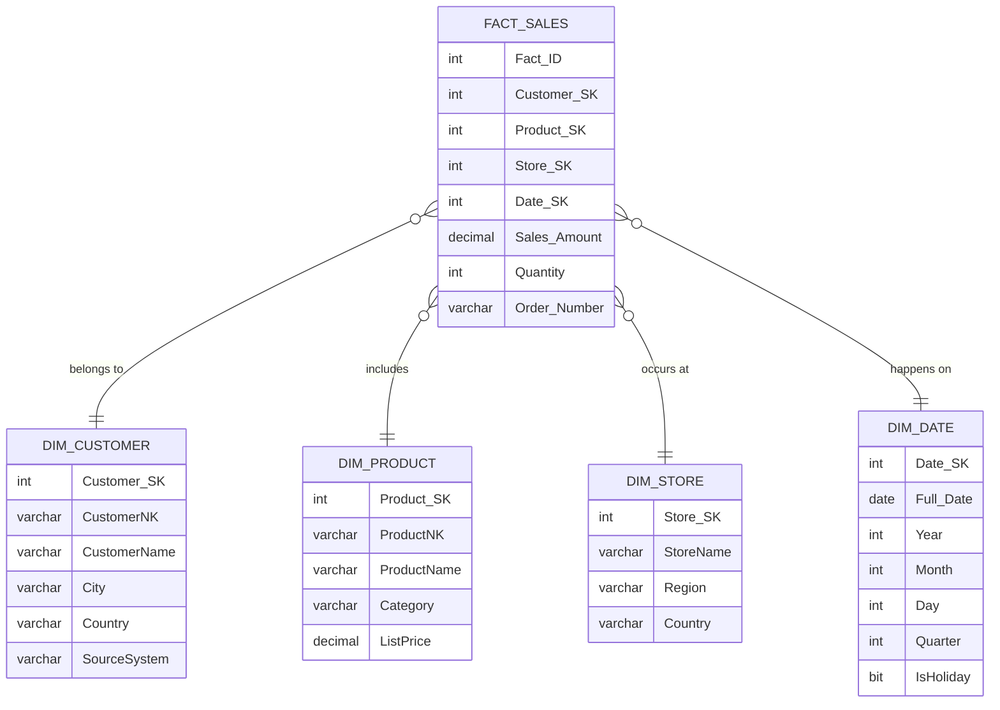

# 📘 Dimensional Modeling 

*Based on: Business Intelligence Guidebook — Chapter 9 (Dimensional Modeling)*

---

## Table of Contents

1. Introduction
2. Core concepts: Facts and Dimensions
3. Fact tables — keys, measures, grain
4. Types of measures (additive, semiadditive, non-additive)
5. Dimension design — attributes, hierarchies, keys
6. Keys: Natural Key (NK), Smart Key, Surrogate Key (SK)

   * Definitions
   * Why SKs are preferred in DW
   * Implementation patterns
   * Examples
7. Schemas: Star, Snowflake, Multidimensional (OLAP)
8. Types of fact tables: Transaction, Periodic Snapshot, Accumulating Snapshot
9. Advanced dimensions and facts

   * Date dimension
   * Time dimension and time bands
   * Role-playing dimensions
   * Degenerate dimensions
   * Factless facts (event tables)
   * Consolidated fact tables
10. Achieving consistency: Conformed dimensions & conformed facts
11. ETL considerations and best practices

* Handling nulls and unknowns
* Surrogate key generation and lookups
* Slowly Changing Dimensions (SCD) handling notes
* Loading process pseudocode

12. Design checklist
13. Example star schema (Mermaid diagram)
14. SQL examples (DDL and simple queries)
15. Appendix: Quick reference tables and patterns

---

# 1. Introduction

Dimensional modeling is a logical design technique for **Data Warehouses (DW)** and **Business Intelligence (BI)** systems. Its purpose is to structure data for fast, intuitive reporting and analysis rather than for transactional processing.

Key principle: model business events as **Facts** and provide descriptive **Dimensions** that give context to those facts.

---

# 2. Core concepts: Facts and Dimensions

* **Fact**: a numeric measurement of a business event (e.g., SalesAmount, Quantity). Facts are stored in *fact tables*.
* **Dimension**: descriptive attributes that provide context (e.g., Customer, Product, Date). Dimensions are stored in *dimension tables*.

Facts answer "how much / how many" questions; dimensions answer "who / what / where / when / why".

---

# 3. Fact tables — keys, measures, grain

**Structure of a fact table**:

* One or more foreign keys (FK) to dimensions.
* One or more measures (numeric values).
* Possibly degenerate dimensions or transaction identifiers stored in the fact.

**Grain (granularity)** defines the meaning of a single fact row (e.g., one row = one product sold in one order line on a specific date at a specific store). Decide grain *before* designing the schema.

Primary key in a fact table is often a composite of the FK columns; if uniqueness cannot be guaranteed, a surrogate primary key (Fact_SK) or degenerative dimension may be used.

---

# 4. Types of measures

* **Additive**: can be summed across all dimensions (e.g., quantity, sales amount).
* **Semi-additive**: can be summed across some dimensions but not others (e.g., account balance over time; summing months is meaningless without context).
* **Non-additive**: cannot be summed meaningfully (e.g., ratios, unit prices).

Knowing the type prevents incorrect aggregations and misinterpretation.

---

# 5. Dimension design — attributes, hierarchies, keys

**Characteristics of good dimension attributes**:

* Descriptive and meaningful to business users.
* Complete (avoid missing values where possible).
* Unique row identity (each row must be uniquely identifiable).
* Valid (values should be within expected domain).

**Hierarchies** represent many-to-one relationships (e.g., City -> Region -> Country, Day -> Month -> Quarter -> Year). Use them to enable drill-down/roll-up.

**Primary key practice**: Use a single surrogate key (integer) as the PK for each dimension; store source natural key(s) as alternate columns.

---

# 6. Keys: Natural Key (NK), Smart Key, Surrogate Key (SK)

## Definitions

* **Natural Key (NK)**: Key that exists in the source system and has business meaning (e.g., CustomerID, ProductCode).
* **Smart Key**: A form of natural key that encodes multiple attributes in one string (e.g., PRD-KSA-A12-RED-2025). It carries embedded information but is brittle and often long.
* **Surrogate Key (SK)**: Artificial, system-generated identifier used as the primary key in dimension tables. Typically an integer (e.g., Customer_SK = 101). SK has no business meaning.

## Why use Surrogate Keys?

* **Consistency across sources**: When multiple systems have different natural keys, SK provides a consistent identifier.
* **Stability**: Natural keys or smart keys can change; SKs remain stable in the DW.
* **Performance**: Integer SKs are compact and fast to index and join.
* **Manage SCDs**: SKs allow multiple rows for the same business entity (historical versions) without changing joins in fact tables.

## Recommended pattern

* Use `Surrogate Key` as the dimension primary key.
* Keep `Natural Key` and `Source System ID (SOR_NK)` as columns for traceability.
* If multiple source systems use different natural keys, include a `SourceSystem` column or multipart alternate key.

## Examples

**Dim Customer (conceptual)**

```
Customer_SK INT PRIMARY KEY -- surrogate key assigned by DW
CustomerNK VARCHAR(...)    -- original natural key from source
SourceSystem VARCHAR(...)  -- source identifier if multiple sources
CustomerName VARCHAR(...)
City VARCHAR(...)
Country VARCHAR(...)
```

**Why not use smart keys in DW?**

* Long strings increase storage and slow joins.
* Encoding rules may change, breaking consistency.
* Smart keys can hide semantics that should be in descriptive attributes.

---

# 7. Schemas: Star, Snowflake, Multidimensional (OLAP)

### Star Schema

* One centralized fact table connected to denormalized dimension tables.
* Very common: simple, intuitive for business users; good query performance.

### Snowflake Schema

* Dimensions are normalized into multiple tables representing hierarchy levels.
* Reduces redundancy but increases join complexity; sometimes used when hierarchies are large and static.

### Multidimensional / OLAP

* Data stored in cubes (multidimensional arrays) with aggregated data precomputed in different levels; supports fast slicing/dicing and hierarchies.

---

# 8. Types of fact tables

* **Transaction Fact**: Records each business event (e.g., every sale line). Most common.
* **Periodic Snapshot Fact**: Records a snapshot at regular intervals (e.g., daily account balance, monthly inventory). Useful for trends at fixed times.
* **Accumulating Snapshot Fact**: One row per lifecycle instance with columns updated as the process advances (e.g., order placed -> payment -> shipped -> delivered). Good for process tracking.

---

# 9. Advanced dimensions and facts

## Date dimension

* A workhorse of DW. Every fact usually links to at least one date.
* **Best practice**: Use `Date_SK` in `YYYYMMDD` integer format (e.g., 19910303). This is the one case where the surrogate key is a meaningful format — it ensures consistency across date dimensions.
* Mandatory columns: `Date_SK`, `Date_Value` (DATE). Additional columns: Year, Month, Quarter, DayOfWeek, IsHoliday, FiscalYear, FiscalMonth, flags, seasonal flags.
* Benefit: compute date functions once at load time, improving query speed and consistency.

## Time dimension

* Use when time-of-day analysis is required.
* Approaches:

  1. **Time-of-day as a fact**: Keep a `DATETIME` column in fact and a `Date_SK` FK; use for occasional time analysis.
  2. **Time as a dimension**: Create `Dim_Time` with grain (hour/minute/second) and link via `Time_SK`.
* Choose grain according to business need — hours, minutes, or seconds.
* Consider time bands (e.g., morning commute, lunch) as attributes in the time dimension.

## Role-playing dimensions

* When the same dimension is used multiple times for different roles (e.g., order date, ship date, delivery date), implement a single physical dimension and exposed role-specific **views** (e.g., `vDimOrderDate`, `vDimShipDate`) to avoid duplication.

## Degenerate dimensions

* Transaction identifiers or reference numbers that don't need a separate dimension (e.g., `OrderNumber`, `TrackingNumber`) — stored in fact table for traceability.

## Factless fact tables (Event tables)

* Record occurrences without natural numeric measures (e.g., student attendance). Implement a dummy counter (1/0) as a measure so events can be counted and filtered.

## Consolidated fact tables

* Combine related facts (e.g., Actual vs Forecast) when they share conformed dimensions and the same grain. Prefer doing consolidation in data marts or cubes rather than the raw DW to preserve detail.

---

# 10. Achieving consistency: Conformed dimensions & conformed facts

**Conformed Dimensions**: Dimensions shared consistently across the enterprise — same structure and values (e.g., single Customer dimension used by Sales, Marketing, Finance). They enable cross-functional reporting.

**Conformed Facts**: Standardized definitions and formulas for measures (e.g., how Revenue is calculated). Document business rules and agree with stakeholders to avoid conflicting definitions.

Tools/Practices: Master Data Management (MDM), Customer Data Integration (CDI), Product Information Management (PIM).

---

# 11. ETL considerations and best practices

## Handling NULLs / Missing Dimension Keys

* FK columns in fact tables **should not be NULL**. If a dimension lookup fails during ETL, assign the fact row to a special dimension row such as `Unknown`, `Missing`, or `Not Applicable` with consistent surrogate key values (commonly negative integers, e.g., -999).
* Optionally create multiple special rows for different reasons ("Unknown", "Deferred", "Invalid") with standardized negative keys.

## Surrogate Key generation and lookup

* During ETL, match incoming natural keys to dimension rows to find the `Surrogate Key`.
* If no match exists, insert a new dimension row (with a new SK) or handle according to SCD rules.
* Maintain an index on natural keys for fast lookups.

## Slowly Changing Dimensions (SCD)

* **Type 0**: No changes (static). Rare.
* **Type 1**: Overwrite attribute values (no history kept). Use when corrections should not keep history.
* **Type 2**: Create new row for changes and assign a new SK (keeps full history). Add `EffectiveDate`, `EndDate`, `CurrentFlag` fields.
* **Type 3**: Add new column(s) to keep limited history (e.g., `PreviousValue`).

Choose SCD type per attribute based on business needs.

## Loading process (high-level ETL pseudocode)

```
For each source record (transaction):
  1. Extract fields
  2. For each dimension D required by the fact:
     a. Lookup natural key in Dim_D
     b. If found -> get D_SK
     c. Else -> if policies allow, insert new row into Dim_D and get new D_SK
     d. If not found and cannot insert -> assign D_SK = special_unknown_key
  3. Build fact row with D_SK foreign keys + measures
  4. Insert fact row into Fact table
```

## Handling multiple source systems

* Store `SourceSystem` column in dimensions or keep a `SourceSystem` indicator combined with natural key to form multipart alternate keys.
* Keep original source natural key(s) in the dimension for traceability (e.g., `CustomerNK`, `CustomerSourceNK`).

## Audit and lineage

* Keep load metadata (ETL run id, load timestamp, source file name) in staging and possibly in dimension/fact `LoadDate` fields for troubleshooting and lineage.

---

# 12. Design checklist (practical)

* [ ] Define the grain (single-most important decision).
* [ ] Enumerate required facts and measures.
* [ ] Identify required dimensions and their attributes.
* [ ] Decide surrogate keys strategy and natural key storage.
* [ ] Define SCD policy per dimension attribute.
* [ ] Build Date and Time dimensions (fiscal vs calendar).
* [ ] Plan for unknown/missing keys and special rows.
* [ ] Identify conformed dimensions and agree on definitions.
* [ ] Create ETL lookups, indexes, and error handling.
* [ ] Build necessary views for role-playing dimensions.
* [ ] Document business rules for all facts (conformed facts).

---

# 13. Example Star Schema (Mermaid diagram)



---

# 14. SQL Examples (DDL + simple ETL snippets)

## Dimension DDL (example)

```sql
CREATE TABLE Dim_Customer (
  Customer_SK INT IDENTITY(1,1) PRIMARY KEY,
  CustomerNK VARCHAR(50) NOT NULL, -- natural key
  SourceSystem VARCHAR(50),
  CustomerName VARCHAR(200),
  City VARCHAR(100),
  Country VARCHAR(100),
  EffectiveDate DATE NULL,
  EndDate DATE NULL,
  CurrentFlag BIT DEFAULT 1
);
```

## Date dimension DDL (example using YYYYMMDD SK)

```sql
CREATE TABLE Dim_Date (
  Date_SK INT PRIMARY KEY, -- YYYYMMDD
  Date_Value DATE NOT NULL,
  Year INT,
  Month INT,
  Day INT,
  Quarter INT,
  DayOfWeek INT,
  IsHoliday BIT
);
```

## Fact DDL (example)

```sql
CREATE TABLE Fact_Sales (
  Fact_ID BIGINT IDENTITY(1,1) PRIMARY KEY,
  Date_SK INT NOT NULL,
  Customer_SK INT NOT NULL,
  Product_SK INT NOT NULL,
  Store_SK INT NULL,
  Quantity INT,
  SalesAmount DECIMAL(18,2),
  OrderNumber VARCHAR(50),
  FOREIGN KEY (Date_SK) REFERENCES Dim_Date(Date_SK),
  FOREIGN KEY (Customer_SK) REFERENCES Dim_Customer(Customer_SK),
  FOREIGN KEY (Product_SK) REFERENCES Dim_Product(Product_SK)
);
```

## ETL lookup snippet (pseudocode SQL-like)

```sql
-- Lookup customer surrogate key
SELECT Customer_SK INTO @cust_sk
FROM Dim_Customer
WHERE CustomerNK = @source_customer_nk
  AND SourceSystem = @source_system;

IF @cust_sk IS NULL
  -- Insert new dimension row (Type 1 or Type 2 logic applied accordingly)
  INSERT INTO Dim_Customer (CustomerNK, SourceSystem, CustomerName, City, Country, EffectiveDate, CurrentFlag)
  VALUES (@source_customer_nk, @source_system, @name, @city, @country, GETDATE(), 1);

  SET @cust_sk = SCOPE_IDENTITY();
END IF;

-- Insert fact row
INSERT INTO Fact_Sales (Date_SK, Customer_SK, Product_SK, Quantity, SalesAmount, OrderNumber)
VALUES (@date_sk, @cust_sk, @prod_sk, @qty, @amount, @order_number);
```

---

# 15. Appendix: Quick reference & patterns

## Handling unknowns

* Insert a single `Unknown` row per dimension with `SurrogateKey = -999` (or other standardized negative values).
* Use consistent naming `Unknown`, `Missing`, `NotApplicable` across all dimensions.

## SCD Type 2 minimal columns

* `EffectiveDate` (start)
* `EndDate` (end)
* `CurrentFlag` (1/0)
* `RecordSource` / `LoadDate`

## Checklist for surrogate keys

* Use integer PK for each dimension.
* Keep natural key(s) as alternate columns.
* Index natural keys for lookup performance.
* Use identity/autoincrement or a surrogate generation table.
